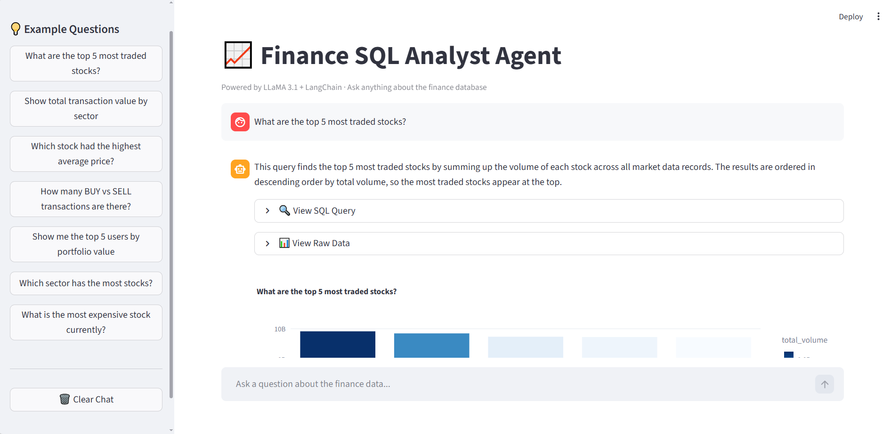

# 📈 Finance SQL Analyst Agent

A conversational AI agent that lets you query a financial database using plain English.
Powered by **LLaMA 3.1** (running locally via Ollama) + **LangChain** + **Streamlit**.

No SQL knowledge required — just ask your question and get answers + visualizations instantly.

---

## 🎥 Demo


> Ask: *"What are the top 5 most traded stocks?"*

The agent:
1. Converts your question → SQL query
2. Executes it against the finance database
3. Returns a plain-English explanation
4. Generates an automatic visualization

---

## 🧠 How It Works
```
User Question
     ↓
LangChain Agent (reads DB schema automatically)
     ↓
LLaMA 3.1 via Ollama (generates SQL)
     ↓
SQLite Database (executes query)
     ↓
Plotly Chart + Plain English Answer
```

---

## 🗄️ Database Schema

| Table | Description |
|---|---|
| `stocks` | 15 stocks with ticker, sector, price |
| `transactions` | 500 buy/sell trades over 12 months |
| `portfolio` | Holdings per user |
| `market_data` | Daily OHLCV data for all stocks |

---

## 💡 Example Questions You Can Ask

- *"What are the top 5 most traded stocks?"*
- *"Show total transaction value by sector"*
- *"How many BUY vs SELL transactions are there?"*
- *"Which stock had the highest average price?"*
- *"Show me the top 5 users by portfolio value"*

---

## 🛠️ Tech Stack

| Tool | Role |
|---|---|
| LLaMA 3.1 (Ollama) | Local LLM for SQL generation |
| LangChain | Agent orchestration |
| SQLite | Finance database |
| Streamlit | Chat UI |
| Plotly | Auto-generated charts |
| Pandas | Data handling |

---

## 🚀 Run It Locally

**1. Install Ollama and pull the model**
```bash
# Download from https://ollama.com
ollama pull llama3.1
```

**2. Clone the repo and install dependencies**
```bash
git clone https://github.com/YOUR_USERNAME/sql-analyst-agent
cd sql-analyst-agent
python -m venv venv
venv\Scripts\activate  # Windows
pip install -r requirements.txt
```

**3. Seed the database**
```bash
python scripts/seed_database.py
```

**4. Launch the app**
```bash
streamlit run app.py
```

---

## 📁 Project Structure
```
sql-analyst-agent/
├── app.py              # Streamlit frontend
├── agent.py            # LangChain + Ollama agent
├── database.py         # DB connection and schema reader
├── visualizer.py       # Auto chart generation
├── scripts/
│   └── seed_database.py  # Generates the finance database
├── requirements.txt
└── README.md
```